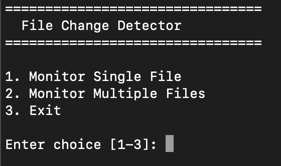
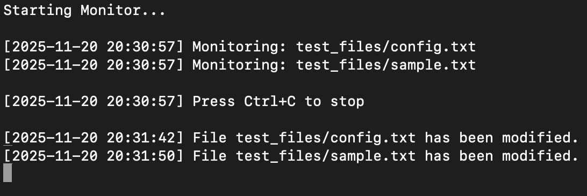
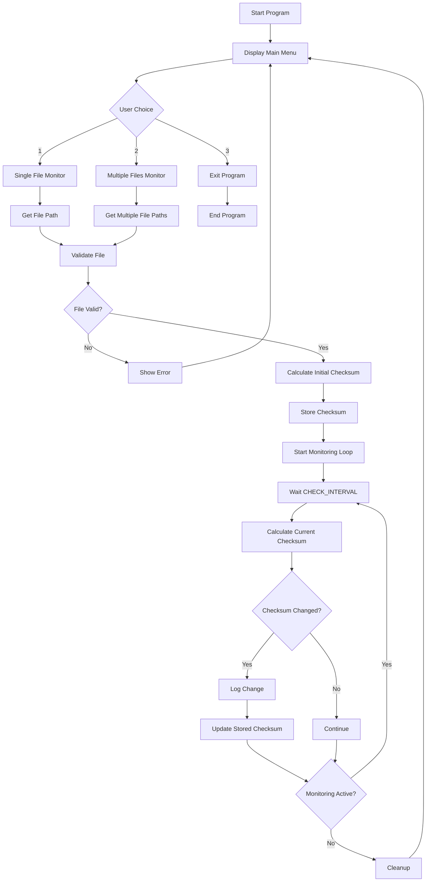
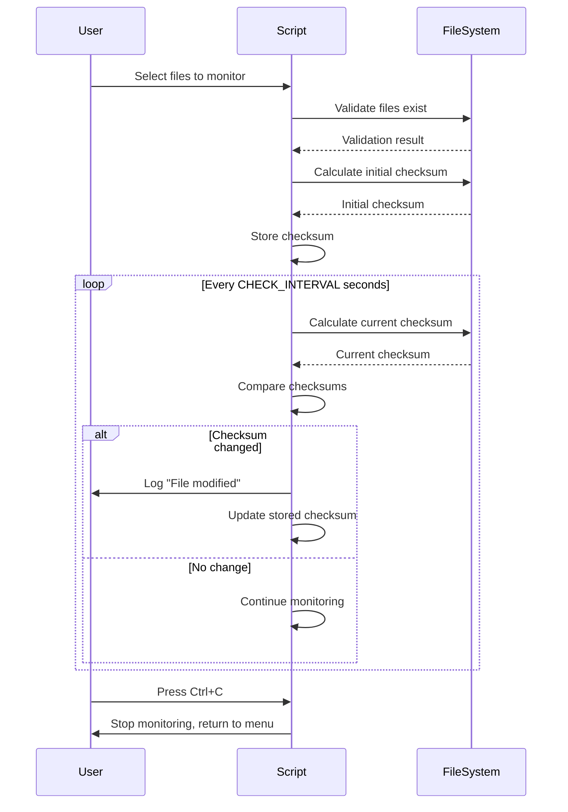

# File Change Detector 🔍

[
[](https://github.com)

A robust Bash script for monitoring file changes in real-time using checksum verification. This tool detects modifications to single or multiple files and logs changes with timestamps.


> *Replace the above placeholder with your actual demo GIF or screenshot*

## 📋 Table of Contents

- [Features](#features)
- [Prerequisites](#prerequisites)
- [Installation](#installation)
- [Usage](#usage)
- [How It Works](#how-it-works)
- [Configuration](#configuration)
- [Examples](#example-use-cases)
- [Troubleshooting](#troubleshooting)
- [Contributing](#contributing)

## Features

- 📁 Monitor single or multiple files simultaneously
- 🔍 Checksum-based change detection (MD5/SHA/stat fallback)
- ⏰ Real-time monitoring with configurable intervals
- 📝 Optional logging to file
- 🛡️ Built-in file validation and error handling
- 🎯 Cross-platform compatibility (Linux, macOS, Unix-like systems)

## Prerequisites

- Bash shell (version 3.2 or higher recommended)
- One of the following checksum tools (automatically detected):
  - `md5` (macOS)
  - `md5sum` (Linux)
  - `shasum` (fallback)
  - `stat` (final fallback)

## Installation

1. Clone this repository:
```bash
git clone https://github.com/yourusername/file-change-detector.git
cd file-change-detector
```

2. Make the script executable:
```bash
chmod +x file-monitor.sh
```

3. Run the script:
```bash
./file-monitor.sh
```

### Alternative: Direct Download

```bash
wget https://raw.githubusercontent.com/yourusername/file-change-detector/main/file-monitor.sh
chmod +x file-monitor.sh
./file-monitor.sh
```

## Usage

### Main Menu

When you run the script, you'll see the main menu:

```
================================
  File Change Detector
================================

1. Monitor Single File
2. Monitor Multiple Files
3. Exit

Enter choice [1-3]:
```

**Screenshot placeholder:** 


*Main menu interface showing monitoring options*

### Option 1: Monitor Single File

1. Select option `1` from the main menu
2. Enter the full path to the file you want to monitor
3. Press Enter to start monitoring
4. Press `Ctrl+C` to stop monitoring

Example:
```
Enter file path: test_files/sample.txt 
```

### Option 2: Monitor Multiple Files

1. Select option `2` from the main menu
2. Enter multiple file paths separated by spaces
3. Press Enter to start monitoring
4. Press `Ctrl+C` to stop monitoring

Example:
```
Files: test_files/config.txt ./test_files/sample.txt 
```

### Monitoring Output

When files are being monitored, you'll see output like this:

```
Starting Monitor...

[2025-11-20 14:30:45] Monitoring: test_files/sample.txt
[2025-11-20 14:30:45] Press Ctrl+C to stop

[2025-11-20 14:31:02] File test_files/sample.txt has been modified.
[2025-11-20 14:32:18] File test_files/sample.txt has been modified.
```


*Real-time file change detection output*

## How It Works

### System Flowchart



### Change Detection Process



## Configuration

You can modify these variables at the top of the script:

| Variable | Default | Description |
|----------|---------|-------------|
| `CHECK_INTERVAL` | 2 | Seconds between checks |
| `LOG_FILE` | "" | Path to log file (empty = console only) |

Example configuration:
```bash
CHECK_INTERVAL=5
LOG_FILE="/var/log/file-monitor.log"
```

## Key Functions

### Core Functions

- **`calculate_checksum(file)`** - Generates checksum using available tools
- **`validate_file(file)`** - Checks if file exists and is readable
- **`start_monitoring(files...)`** - Main monitoring loop
- **`log_message(message)`** - Logs with timestamp to console/file
- **`handle_interrupt()`** - Gracefully handles Ctrl+C

### Checksum Priority

The script tries these methods in order:
1. `md5` (macOS native)
2. `md5sum` (Linux standard)
3. `shasum` (cross-platform)
4. `stat` (fallback using size and modification time)

## Error Handling

The script handles these scenarios:

- ✅ Non-existent files
- ✅ Unreadable files (permission issues)
- ✅ Files deleted during monitoring
- ✅ Invalid menu choices
- ✅ Empty input
- ✅ Graceful shutdown on interrupt

## Example Use Cases

### 1. Monitor Configuration File
```bash
# Watch for changes to nginx config
./file-monitor.sh
# Select option 1
# Enter: test_files/sample.txt 
```

### 2. Monitor Log Files
```bash
# Watch multiple application logs
./file-monitor.sh
# Select option 2
# Enter: /var/log/app.log /var/log/error.log /var/log/access.log
```

### 3. Development Workflow
```bash
# Monitor source files during development
./file-monitor.sh
# Select option 2
# Enter: test_files/config.txt ./test_files/sample.txt 
```

## Troubleshooting

### Issue: "Command not found"
**Solution:** Ensure the script has execute permissions:
```bash
chmod +x file-monitor.sh
```

### Issue: "File is not readable"
**Solution:** Check file permissions:
```bash
ls -l /path/to/file
chmod +r /path/to/file  # Add read permission if needed
```

### Issue: No changes detected
**Solution:** 
- Verify the `CHECK_INTERVAL` isn't too long
- Ensure the file is actually being modified (check timestamps)
- Try with a shorter interval for testing

## Limitations

- Only detects content changes, not metadata changes (permissions, ownership)
- Requires read access to monitored files
- Interval-based checking (not instant notification)
- No recursive directory monitoring

## Future Enhancements

- [ ] Add recursive directory monitoring
- [ ] Email/webhook notifications on changes
- [ ] Configuration file support
- [ ] Filter by file extensions
- [ ] Diff output showing what changed
- [ ] Background daemon mode

## Contributing

Contributions are welcome! Here's how you can help:

1. Fork the repository
2. Create a feature branch (`git checkout -b feature/AmazingFeature`)
3. Commit your changes (`git commit -m 'Add some AmazingFeature'`)
4. Push to the branch (`git push origin feature/AmazingFeature`)
5. Open a Pull Request

### Development Guidelines

- Follow existing code style and conventions
- Add comments for complex logic
- Test on both Linux and macOS if possible
- Update documentation for new features

## Star History

If you find this project useful, please consider giving it a ⭐️!

[](https://star-history.com/#yourusername/file-change-detector&Date)

---

## Project Summary

**File Change Detector** is a lightweight, portable Bash utility for monitoring file modifications in real-time. It uses checksum verification to detect changes and provides a user-friendly menu interface for monitoring single or multiple files simultaneously.

**Key Highlights:**
- **Zero dependencies** beyond standard Unix tools
- **Cross-platform** compatibility (Linux, macOS, BSD)
- **Robust error handling** with graceful degradation
- **Flexible monitoring** for both single and multiple files
- **Timestamped logging** for audit trails
- **Clean interrupt handling** for safe monitoring control

**Technical Approach:**
The script employs a polling mechanism that periodically calculates file checksums and compares them against stored values. When a mismatch is detected, it logs the change and updates the stored checksum. The implementation prioritizes reliability through multiple fallback mechanisms for checksum calculation and comprehensive file validation.

**Best For:**
- Configuration file monitoring
- Log file tracking
- Development workflow automation
- System administration tasks
- Security monitoring
- Backup verification

**Performance:**
With a default 2-second check interval, the script is lightweight and efficient, consuming minimal system resources even when monitoring multiple files simultaneously.
